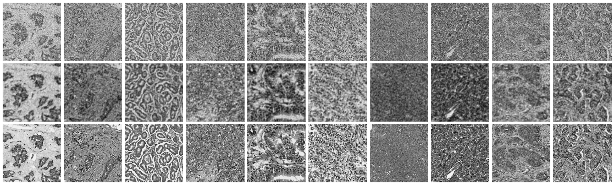
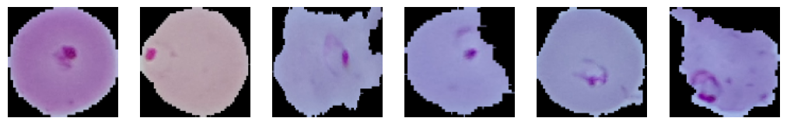

# Autoencoder for Denoising Tissue Images

This project demonstrates the use of a convolutional autoencoder to denoise tissue images from microscope. The autoencoder learns to reconstruct clean images from noisy inputs, which are artificially generated by adding random noise to clean images.

# Autoencoder for Detecting Malaria Infected Cells

This project uses an autoencoder model to reconstruct images of uninfected cells. The model learns to encode and decode the images in such a way that the output is a reconstruction of the original uninfected cell image. Later, when an infected cell image is input into the model, the model will recognize the discrepancy in reconstruction through the calculation of the mean squared error (MSE). This higher MSE for the infected cells compared to the uninfected ones helps the model identify infected cells. Essentially, the model detects the difference between the two types of images based on how well it can reconstruct them.

